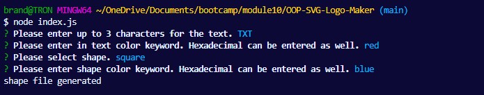
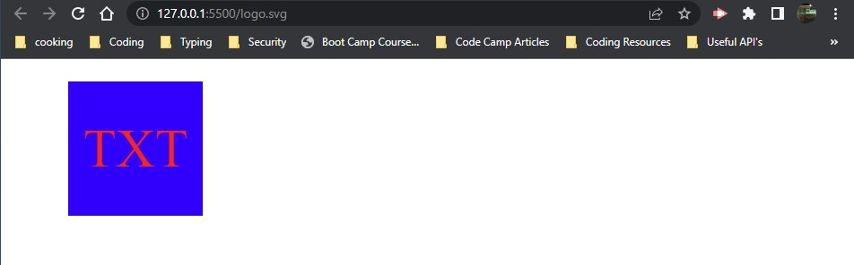

# OOP-SVG-Logo-Maker

## Description

This project was created to allow for the easy creation of an SVG logo graphic.  This would allow a user to input some informtation and create a quick logo graphic to be used.  In creating this project I was able to learn more about rending an SVG vector graphic, and how JavaScript can be used to creat an application to expedite this process.  I was also able to futher hone my skills in SVG coding and in implementing testing into my coding skillset as well with jest.

## Walkthrough Video URL
https://youtu.be/o-U5DN4qMGQ

## Table of Contents 

- [Installation](#installation)
- [Usage](#usage)
- [Credits](#credits)
- [License](#license)

## Installation

To install this application the user will need to run the command "npm i" from the terminal to install the required dependencies.  Once the user has installed the required dependencies the user will run the application from the CLI using "node index.js"

## Usage

To use the application, the user will need to run "node index.js" in the CLI to start the application.  Once the user has run this command, the user will be presented with a couple of question within the CLI that will help the application build the logo.  The user will first select the logo shape that is needed.  Once the Shape has been selected the user will then be prompted to enter in the text that is needed for the logo.  Once these questions have been answered the application will generate an SVG logo file for the user, using the criteria provided by the user.

once the application has generated the file,  you will be able to open the logo in browser to view it.

## Credits

MDN Web Docs Documentation for SVG:
https://developer.mozilla.org/en-US/docs/Web/SVG

Inquirer List Documentation:
https://www.digitalocean.com/community/tutorials/nodejs-interactive-command-line-prompts

## License

This project is covered by an MIT license.

## Tests

To run the built in test for the application just type in the command "npm run test".  This will run the jest test and will confirm that the application is passing the test.